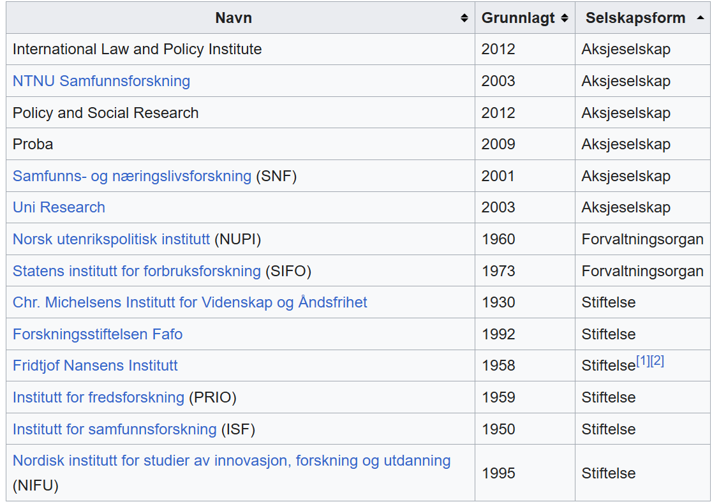

# Brief CV

- MSc in Social Statistics (+ International Development)
- PhD, 2019
- Researcher, NIFU, 2018
- Researcher II, Høyskolen Kristiania, 2024
- Consultant, Nokut, 2026
- Founder, Validaris AS, 2026
- Experience from 25+ surveys

## NIFU

- Educational research 
  - kindergarten ↔ university and higher vocational
- Innovation, research/bibliometrics and related fields

- 15% "free time", rest commissioned or grants

## My work at NIFU
- 90% survey-work (all steps of the process)
  - Sometimes only a single step
- High degree of grant-based operational work
- Prefer "pupils' 21st century skills in G1-G10"
  - Rarely occurs, but often nearby interests

# University vs research institute

::: {.notes}
- Never "We fund you if your study support our belief"
- Udir/KD/HK-dir/KMD/NAV => Mostly professional agencies
- But _given_ scope, _suggested_ RQs and/or general methods (survey)
:::

## Similarities UiO & NIFU
- Competent and motivated PhD-level colleagues
- Variety and things to learn
- Less exciting stuff (admin, projects, collabs, etc)
- Metrics → stress: Funding, publication, duties

## Differences
- Teaching vs commissioned research
- Depth vs width
  - Time per task
  - Different contexts
- Job safety
- Salary and perks

::: {.notes}
**Salary and perks**
- Starting salary at level of associate professor
- Not so great as a senior
- Sports: workout groups, bouldering, PT, football, pingpong, padel, interval runs, special events
- Social: 4 bigger parties per year, lønningspils, weekly newspaper quiz, group chess, common eating time in the canteen
- Academic: quantitative brown bag seminars
:::

## The small font
- Near-fluent Norwegian language requirement
- Randomness in calls and collaborator availability
- Hard to predict own behaviour and growth
- = your milage may differ. 

## What made me choose NIFU after my doctoral research fellowship at CEMO?

. . .

- Butterfly effect?

. . .

- Seeking real data and policy-impacting projects
- Knew two there who informed me
- Only relevant and available job when I was searching and got it immediately...

# Example years
- q = at least general quantitative
- s = at least survey-work
- p = proper psychometric analyses

- _commissioned research_
- **research grants**

## Junior: 2019

- Teachers' digital competences (_USN_; p)
- Questions to School-Norway (_Udir_; s)
- Merger at University College Vestlandet (_HVL_; s)
- Reviewing measures of Norwegians' digital skills (_KMD_; q)
- RCT of an ed-tech marketing game (**RFF**; p)
- RCT of an extra teacher (**RCN**; p)
- ++ many smaller tasks
- Finishing PhD/defence/awards/etc in spare time

## Senior: 2026

- Revising the higher vocational student survey (_HK-dir_; p)
- Schools' implementation of _Health and Life Skills_ (**ERC**; p)
- After-school care for inclusion (**RCN**; s)
- Students' GenAI skills across 5 countries (**NordForsk**; p)
- Review of suvey recruitment strategies (**core funding**; s)
- Measuring executives' room to maneuver (_Spekter_; p)
- RCT on teacher PD (**RCN proposal**; p)
- +++ Backlog

